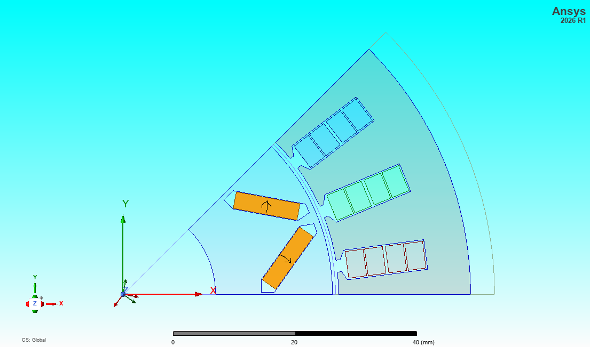
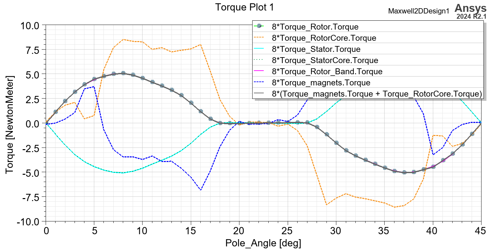
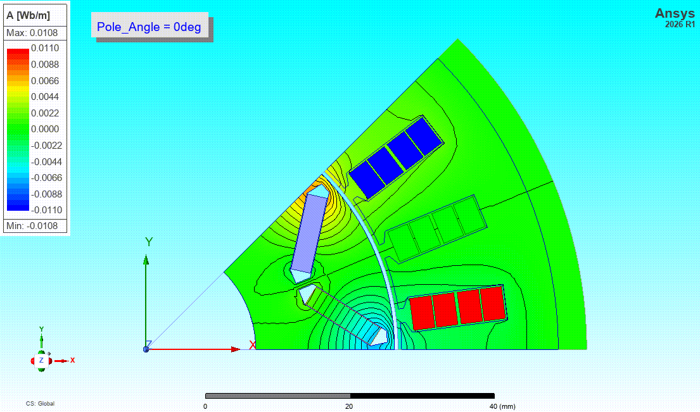
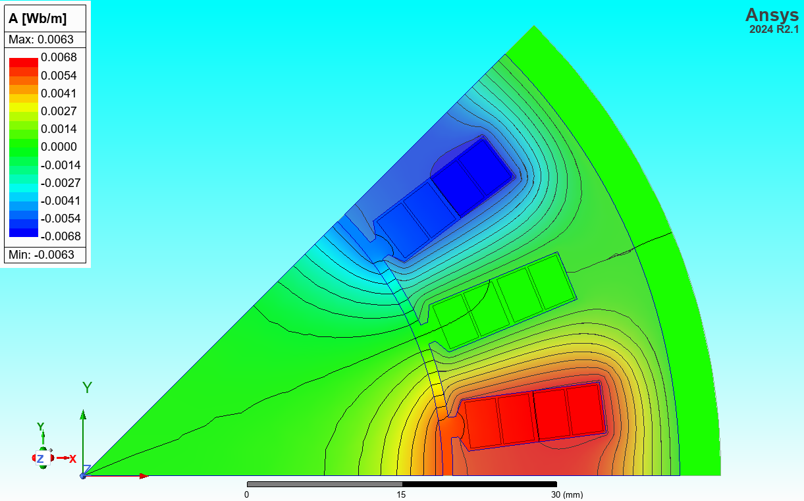

# Torque-Angle Characteristic of an IPM Motor

The torque-angle characteristic of an IPM motor can be calculated in multiple ways. In nature, it shows how the electromagnetic torque changes with the electrical angle between the rotor pole axis and the axis of the stator magnetomotive force created by stator windings.

## Magnetostatic Analysis with a Sweep of Rotor Positions

This is the most straightforward approach one can think of, but in terms of model setup, it is not trivial at all, especially when a partial geometry model is used. In that case, permanent magnets may be split into pieces at certain rotor positions, and we need to keep the right magnetization for every magnet piece all the time. RelativeCS are useful in such cases to define the magnetization when the geometry changes. Sixteen relativeCS (RelativeCS1 to RelativeCS16) have been created and parameterized by the rotor position angle for magnetization assignments, so when the rotor rotates, the magnetization directions of magnets are moving accordingly too. 

A full rotor is used at the first place for rotation before we split the full rotor geometry into a 1/8th sector. 

When the rotor position changes, the 1/8th rotor geometry changes accordingly. Some magnet pieces will become unclassified and not visible in the 1/8th sector. In this case, the torque parameter should be assigned to all the magnets (regardless of unclassified or valid pieces) and the rotor as when the rotor rotates, magnets will come into and leave the 1/8th sector one after another.

With this setup, we can get the torque-angle characteristic (a 45deg window is sufficient as it is an 8-pole motor), as shown below.

The flux line plots at different rotor positions from 0deg to 45deg are shown in the animation.

The current excitations assigned to the phase windings are balanced 3-phase and a phase angle of -30deg is used to position the axis of magnetomotive force created by the stator winding at the middle line of the 1/8th sector. In this approach, the mesh is adaptively refined for each rotor position. 

The axis of the magnetomotive force from the stator winding can be easily visualized by setting the rotor to a round one.

## Magnetic Transient Analysis with a Sweep of Winding Current Phase Angles

In this approach, the rotor rotation is synchronized with the rotation of the magnetomotive force created by the stator winding. The 3-phase AC currents are fed into the motor windings. A parametric sweep of magnetic transient simulations using different rotor positions can be performed to get the average torque (typically one electrical period is sufficient with 20-100 time steps per period) vs. rotor position. This approach can make full use of the sliding mesh available in magnetic transient (time-stepping) FEA.

## Magnetic Transient Analysis with a Sweep of Rotor Positions

In this approach, DC currents are fed into the 3-phase stator windings. The rotor position change is achieved by setting up mechanical motion to the rotor thru band. This approach can make full use of the sliding mesh available in magnetic transient (time-stepping) FEA.
